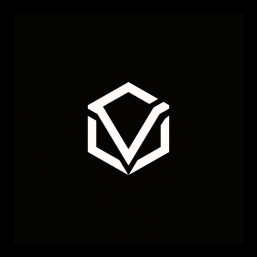

# Vault IDE

<p align="center">
  
</p>

Welcome to Vault, a high-performance, multiplayer code editor. Vault is designed to be an incredibly fast, modern, and extensible developer workspace, built with a GPU-accelerated interface for fluid and responsive editing. Vault is a custom, rebranded fork of the Zed Code Editor.

---

### Platform Availability & Resource Notice

> [!IMPORTANT]
> Due to a lack of CI/CD build processing power and platform compilation resource constraints, official pre-built release packages (such as our `.deb` installer) are **only available for Linux**. 
> 
> To run Vault on other operating systems (such as macOS or Windows), you will need to build the project from source specifically for your operating system. We will certainly expand our build infrastructure in the future to deliver pre-built installers for every major platform!

### Installation

#### Linux (Debian / Ubuntu / Pop!_OS)
Download the latest official Debian package (`.deb`) directly from our [GitHub Releases](https://github.com/DeepNerd-AI/Vault/releases) page and install it using your package manager:

```bash
sudo dpkg -i vault-linux-*.deb
sudo apt-get install -f # Install any missing dependencies if needed
```

#### Other Operating Systems (macOS, Windows, other Linux distributions)
Since precompiled packages are not provided for other platforms due to processing power constraints, please follow the local build documentation below to compile Vault specifically for your own operating system:

- [Building Vault for Linux](./docs/src/development/linux.md)
- [Building Vault for macOS](./docs/src/development/macos.md)
- [Building Vault for Windows](./docs/src/development/windows.md)

### Developing Vault

Vault is built in Rust. If you wish to contribute to Vault or run it locally:

1. Clone the repository:
   ```bash
   git clone https://github.com/DeepNerd-AI/Vault.git
   cd Vault
   ```
2. Build the editor in release mode:
   ```bash
   cargo build --release
   ```

### Contributing

We welcome community contributions to make Vault even better! See [CONTRIBUTING.md](./CONTRIBUTING.md) for guidelines on how to get involved.

### Licensing

License information for third party dependencies must be correctly provided for CI to pass.

We use `cargo-about` to automatically comply with open-source licenses. If CI is failing, check the following:

- Is it showing a `no license specified` error for a crate you've created? If so, add `publish = false` under `[package]` in your crate's Cargo.toml.
- Is the error `failed to satisfy license requirements` for a dependency? If so, first determine what license the project has and whether this system is sufficient to comply with this license's requirements. Once you've verified that this system is acceptable, add the license's SPDX identifier to the `accepted` array in `script/licenses/zed-licenses.toml`.
- Is `cargo-about` unable to find the license for a dependency? If so, add a clarification field at the end of `script/licenses/zed-licenses.toml`, as specified in the `cargo-about` documentation.

## Sponsorship & Support

Vault is developed by **DeepNerd-AI**. If you would like to support the development of Vault, please consider sponsoring our organization on GitHub. Sponsorships go directly toward expanding our build infrastructure so we can bring pre-built packages to macOS and Windows soon!
